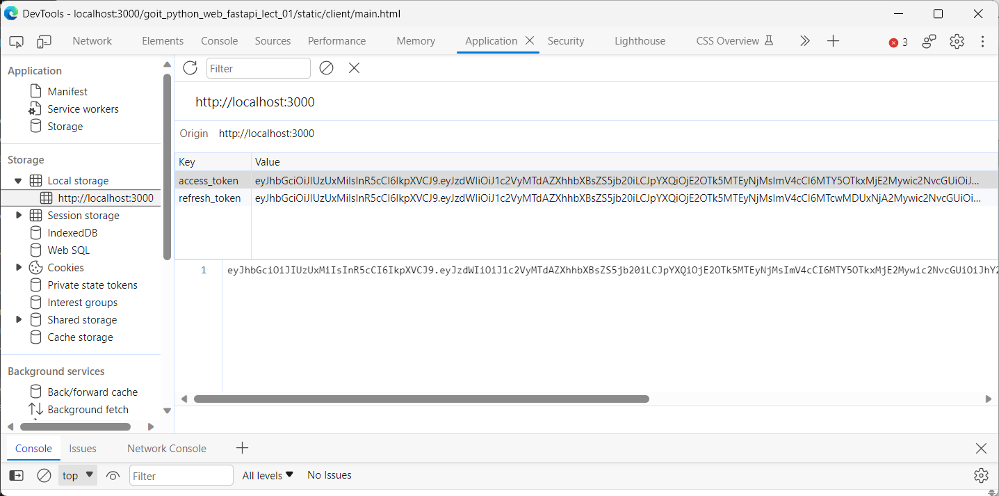

## AUTH
### HTTPBearer, HTTPAuthorizationCredentials
- signup:


- get_token/login by json:


- access with token:


### OAuth2

- get_token/login by oauth2 form:


- get_token/login by oauth2 form:


- get_token/login by oauth2 form:


- access with token:


### OAuth2 + refresh

- get_token/login by oauth2 form with refresh:


- token refresh saved to Database:


- decoded refresh token:


- token refresh by refresh_token:


- decoded new refresh token:


## REAUTH BY REFRESH_TOKEN in COOKIES
Define cookie for refresh_token


Auth using a refresh_token (cookie) sicne access_token has expired and get a new access_token, and the client side should save and use its new new_access_token as the next access_token


Next auth with use new access_token as access_token


Auth using a refresh_token (cookie) and check on saved DB, sicne access_token has expired and get a new access_token, and the client side should save and use its new new_access_token as the next access_token


### USE REFRESH_TOKEN in COOKIES + REFRESH_TOKEN IN DB 

Set changed in DB


Now rigth refresh_token by sign not aceeped, since not same as DB


After wrong refresh_token used, refresh_token in DB cleared


### GRAVATAR LINK


## JavaSript Client
### Login


### Auth token local storage


### List cats and owners


## DOCKER
### .env
```
POSTGRES_USERNAME=postgres
POSTGRES_PASSWORD=XXXXXXX
POSTGRES_HOST=pg,localhost
POSTGRES_PORT=5432
POSTGRES_DB=fastapi
TOKEN_SECRET_KEY="some secret"
AUTH_LIB=OAuth2
```

### RUN
docker-compose up -d code 